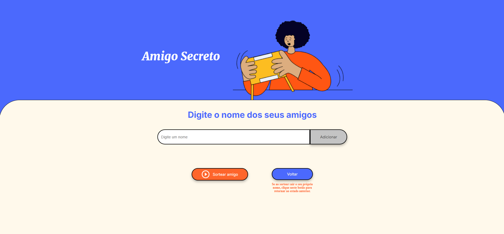

# Amigo Secreto

## Sobre

Este projeto é uma aplicação web simples para sortear amigos secretos. Os usuários podem adicionar nomes à lista de amigos e sortear um amigo secreto aleatoriamente. A aplicação também permite desfazer o último sorteio.

## Funcionalidades

- Adicionar nomes à lista de amigos
- Sortear um amigo secreto aleatoriamente
- Desfazer o último sorteio

## Como Usar

1. Acesse agora o [Link](https://challenge-amigo-secreto-ashen.vercel.app/) para utilizado.
2. Digite o nome de um amigo no campo de entrada e clique no botão "Adicionar" ou clique no botão "Enter".
3. Clique no botão "Sortear amigo" para sortear um amigo secreto.
4. Se caso ao sortear um nome, este nome for o seu, clique no botão "Voltar" para desfazer este último sorteio. Para então realizar outro sorteio clicando no botão "Sortear amigo".

### Tecnologias Utilizadas

### Licença

Este projeto está licenciado sob a [MIT License](LICENSE).
